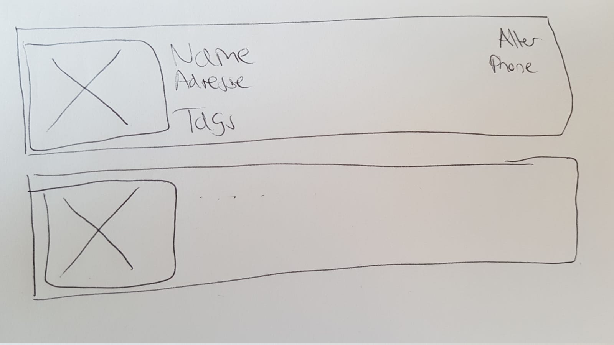

# Layouting mit Komponenten

## Aufgabe
Nachdem die korrekten Daten vom (Fake) Backend geladen werden, wäre es cool, diese noch etwas schöner zu visualisieren. 
Anstatt als JSON sollen diese nun wie folgt untereinander visualisiert werden:

AKs:
* Die Visualisierung eines Employees soll innerhalb einer eigenen Komponente (employee Komponente) passieren. (--> Komponente über angular CLI erzeugen)
* Die Home-Komponente soll für jeden Employee eine solche Komponente erzeugen (--> Schleife im HTML)
* Das Layouting soll über Flexbox passieren (keine Floats!)
* Das Quadrat mit dem X soll das Bild darstellen